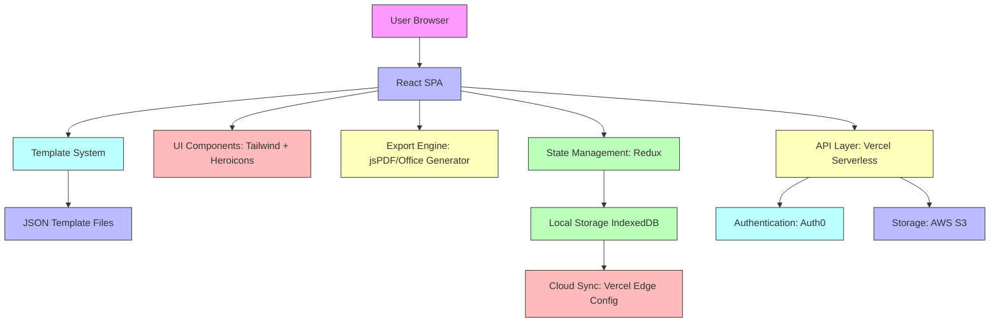

# CV Editor

## Project Description

CV Editor is a professional web application designed to help users create, edit, and export polished resumes with ease. Built with modern web technologies, it provides an intuitive interface for crafting ATS-friendly resumes that stand out to recruiters and pass through applicant tracking systems.

## Key Features

- **Intuitive Drag-and-Drop Interface**: Easily rearrange resume sections
- **Professional Templates**: Multiple industry-approved designs
- **Real-Time Preview**: See changes instantly as you edit
- **ATS Optimization**: Built-in formatting for applicant tracking systems
- **Multiple Export Formats**: PDF, DOCX, and TXT outputs
- **Cloud Synchronization**: Save and access resumes from anywhere
- **Customizable Sections**: Add, remove, or modify resume components
- **Spell Check & Grammar Suggestions**: Built-in writing assistance

## Screenshots

| Landing Page | CV Tailor |
|--------------|-----------|
|  |  |

| Job Scanner | Interview Questions Predictor |
|------------------|------------------------------|
|  |  |

## Technology Stack

| Category | Technology |
|----------|------------|
| **Frontend** | React 18, TypeScript, Tailwind CSS |
| **State Management** | Redux Toolkit |
| **Build Tool** | Vite |
| **Icons** | Heroicons |
| **Export** | jsPDF, Office Generator |
| **Deployment** | Vercel (frontend), AWS S3 (static assets) |
| **Development** | ESLint, Prettier, Jest, React Testing Library |

## System Architecture

## How It Works

1. **Template Selection**: Choose from professionally designed templates
2. **Content Entry**: Fill in your information using the intuitive editor
3. **Real-Time Formatting**: Watch your resume update instantly with perfect spacing
4. **Customization**: Adjust colors, fonts, and layout to match your personal brand
5. **Validation**: Built-in checks for ATS compatibility and content completeness
6. **Export**: Generate PDF, DOCX, or TXT files with one click
7. **Storage**: Save locally or sync to cloud for access across devices

## ATS-Friendly Resume Support

CV Editor ensures your resume passes applicant tracking systems through:
- **Standard Section Headings**: Uses recognizable titles (Experience, Education, Skills)
- **Keyword Optimization**: Fields designed to capture relevant terminology
- **Clean Formatting**: Avoids tables, graphics, and complex layouts that confuse ATS
- **Machine-Readable Text**: All content is selectable and searchable text
- **File Format Compatibility**: Exports to ATS-preferred PDF and DOCX formats

## Export Functionality

- **PDF**: Print-ready, high-resolution output with embedded fonts
- **DOCX**: Fully editable Microsoft Word document
- **TXT**: Plain text version for simple applications
- **Custom Branding**: Option to add personal logo or header
- **Page Settings**: Adjust margins, orientation, and paper size
- **Batch Export**: Generate multiple formats simultaneously

## Future Roadmap

| Feature | Description | Status |
|---------|-------------|--------|
| 🤖 AI-Powered Resume Suggestions | Get intelligent recommendations for content improvement | Planned |
| 📝 Cover Letter Generation | Create matching cover letters with one click | Planned |
| 🔗 LinkedIn Profile Import | Seamlessly import profile data from LinkedIn | Planned |
| 🎨 Additional Resume Templates | Expand template library with industry-specific designs | In Progress |
| 📊 Resume Scoring & ATS Analysis | Get detailed feedback on resume effectiveness | Planned |
| 🌐 Multi-Language Support | Create resumes in multiple languages | Planned |
| ☁️ Team Collaboration | Share and co-edit resumes with colleagues | Planned |
| 🔍 Analytics Dashboard | Track resume views and application success rates | Planned |

## Live Website

Experience CV Editor live at: [https://cv-editor.example.com](https://cv-editor.example.com)

*Note: Replace with your actual live website URL*

## Contact

Have questions or feedback? Reach out to us:

- **Email**: techalchemist9597@gmail.com
- **LinkedIn**: [CV Editor Company Page](https://www.linkedin.com/in/sooraj2004/)
- **Issue Tracker**: [GitHub Issues](https://github.com/Sooraj-Suresh-Dev/CV-Editor/issues)

## Disclaimer

This repository contains project documentation, screenshots, and technical information. The production source code is maintained in a private repository.

## License

This project is licensed under the MIT License - see the [LICENSE](/public/repo/LICENSE) file for details.

---

*Made with ❤️ for job seekers worldwide*