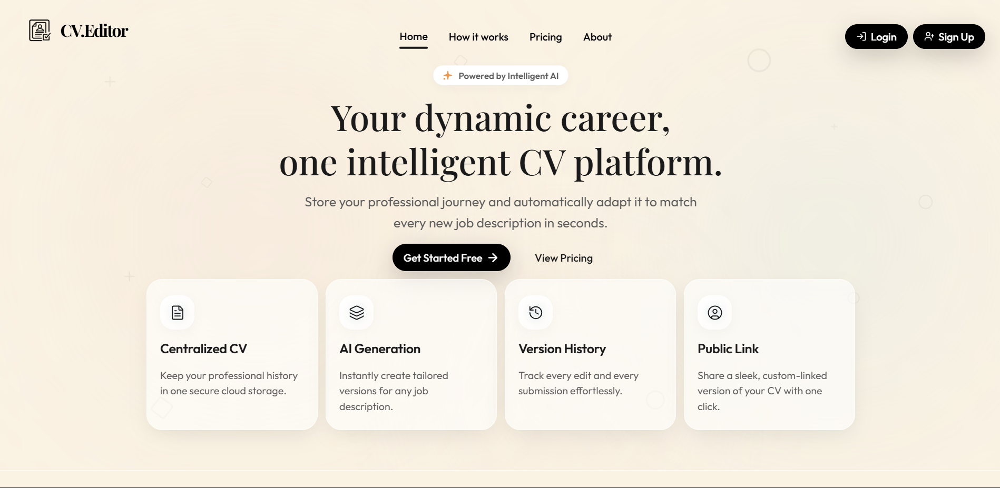
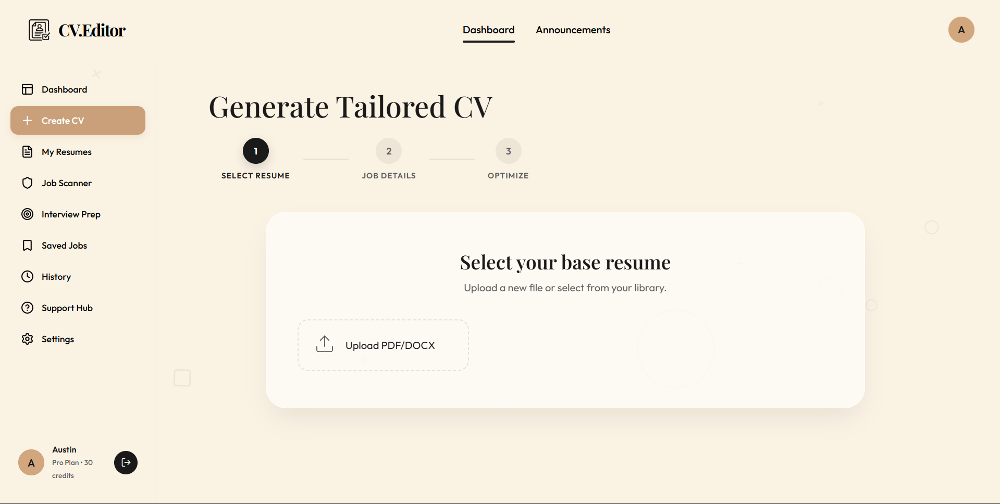
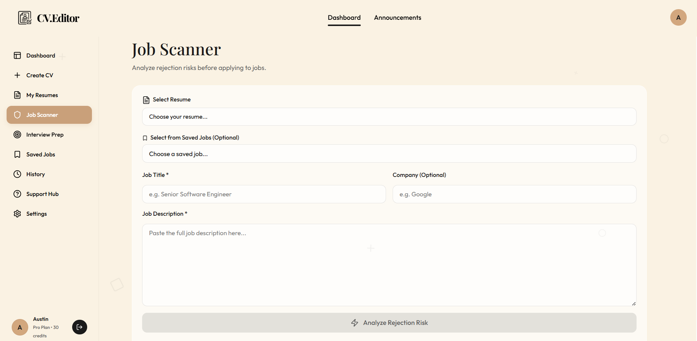
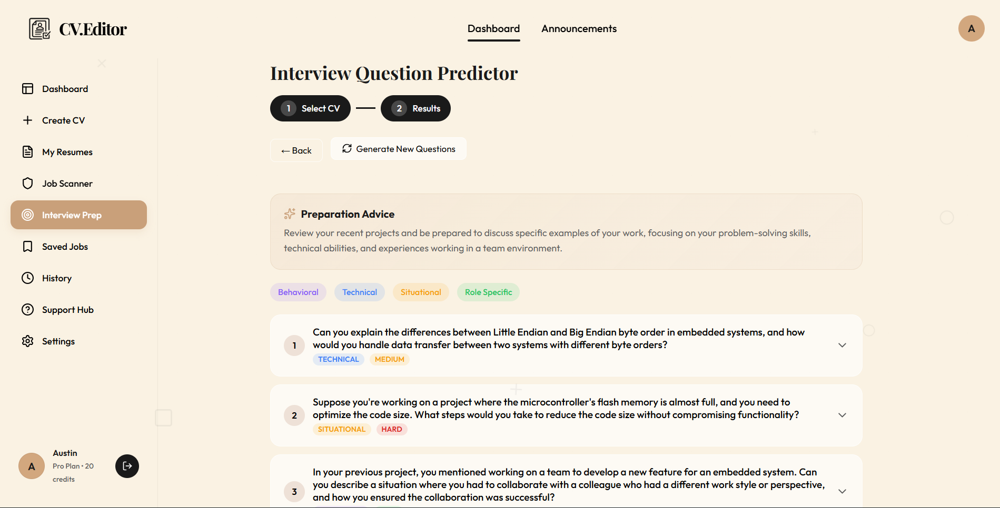
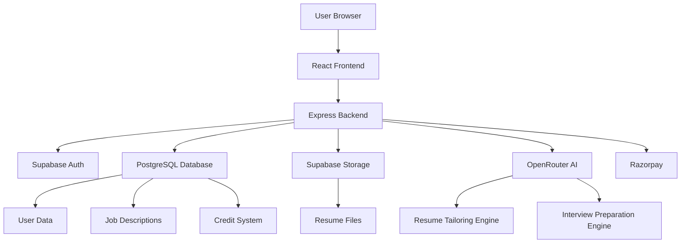

# CV Editor

> AI-Powered Resume Tailoring Platform for Job Seekers

> ⚠️ Note: This public repository contains project documentation, screenshots, architecture details, and feature overviews only. The production source code is maintained in a private repository.

---

## 🌐 Live Demo

**Try CV Editor:**

https://cv-editor-bice.vercel.app

---

# 🚀 Project Overview

CV Editor is an AI-powered SaaS platform designed to help job seekers tailor their resumes for specific job opportunities.

Instead of manually editing resumes for every application, users can upload a base resume, paste a job description, and instantly generate an ATS-optimized version that aligns with the target role.

The platform combines AI-powered resume optimization, document management, interview preparation tools, subscription management, and analytics into a single streamlined experience.

---

# ✨ Key Features

## 🤖 AI Resume Tailoring

- Upload existing resumes (DOCX)
- Paste or save job descriptions
- AI-powered resume optimization
- ATS keyword alignment
- Resume enhancement and restructuring
- Match score analysis
- Optimization summary and recommendations

## 📄 Resume Management

- Secure resume library
- Upload and manage multiple resumes
- Store tailored resume versions
- DOCX export support
- PDF export support

## 💼 Job Management

- Save job descriptions
- Track target positions
- Reuse saved jobs
- Manage application-specific resume versions

## 🎯 Interview Preparation

- AI-generated interview questions
- Job-specific preparation assistance
- Technical and behavioral interview suggestions

## 💳 Subscription & Credits System

- Credit-based AI generation
- Razorpay payment integration
- Dynamic pricing plans
- Pro subscriptions
- Credit purchase workflow

## 📊 User Dashboard

- Resume management
- Credit tracking
- Tailoring history
- Saved jobs
- Account settings

## 🛡️ Admin Dashboard

- User management
- Analytics monitoring
- Promo code management
- Subscription tracking
- Customer support tools

---

# 📸 Screenshots

## Landing Page & AI Resume Tailoring

| Landing Page | AI Resume Tailoring |
|--------------|---------------------|
|  |  |

## Job Scanner & Interview Questions Generator

| Job Scanner | Interview Questions Generator |
|-------------|-------------------------------|
|  |  |

---

# 🛠 Technology Stack

## Frontend

| Technology | Purpose |
|------------|---------|
| React 19 | User Interface |
| TypeScript | Type Safety |
| Vite | Build Tool |
| React Router DOM | Routing |
| Framer Motion | Animations |
| Vanilla CSS | Styling |

## Document Processing

| Technology | Purpose |
|------------|---------|
| Mammoth.js | DOCX Parsing |
| docx-preview | Document Preview |
| @eigenpal/docx-js-editor | DOCX Editing |
| pdfjs-dist | PDF Processing |

## Backend

| Technology | Purpose |
|------------|---------|
| Express.js | REST API |
| Node.js | Server Runtime |

## Database & Infrastructure

| Technology | Purpose |
|------------|---------|
| Supabase PostgreSQL | Database |
| Supabase Auth | Authentication |
| Supabase Storage | File Storage |
| Render | Backend Hosting |
| Vercel | Frontend Hosting |

## AI & Payments

| Technology | Purpose |
|------------|---------|
| OpenRouter API | AI Processing |
| Razorpay | Subscription & Payments |

---

# 🏗 System Architecture

---

# 🗺 Application Routes

## Public Pages

| Route | Description |
|---------|-------------|
| `/` | Landing Page |
| `/about` | About Platform |
| `/how-it-works` | Product Walkthrough |
| `/pricing` | Pricing Plans |

## Authentication

| Route | Description |
|---------|-------------|
| `/login` | User Login |
| `/signup` | User Registration |
| `/auth/callback` | Authentication Callback |

## User Portal

| Route | Description |
|---------|-------------|
| `/onboarding` | First-Time Setup |
| `/dashboard` | Main User Dashboard |
| `/settings` | Account Settings |

## Admin Portal

| Route | Description |
|---------|-------------|
| `/admin` | Platform Administration |

---

# ⚙️ How CV Editor Works

## Step 1 — Upload Resume

Upload your existing resume in DOCX format.

## Step 2 — Add Job Description

Paste a job posting or select a previously saved job.

## Step 3 — AI Analysis

The AI analyzes:

- Required skills
- Keywords
- Experience requirements
- Responsibilities
- Industry terminology

## Step 4 — Resume Optimization

The system:

- Rewrites relevant content
- Aligns ATS keywords
- Improves ATS compatibility
- Enhances professional language
- Increases job relevance

## Step 5 — Review Results

Users receive:

- Tailored resume
- Match score
- Keyword analysis
- Optimization summary

## Step 6 — Export

Download the optimized resume as:

- DOCX
- PDF

---

# 🔒 Security

- JWT-based authentication
- Secure file storage
- Protected API endpoints
- Role-based access control
- Encrypted user sessions
- Secure payment processing

---

# 🚀 Deployment

| Service | Platform |
|----------|----------|
| Frontend | Vercel |
| Backend | Render |
| Database | Supabase PostgreSQL |
| Authentication | Supabase Auth |
| File Storage | Supabase Storage |

---

# 🛣 Future Roadmap

- AI Cover Letter Generator
- Resume Version Comparison
- Advanced ATS Analytics
- LinkedIn Profile Import
- Multi-language Resume Support
- Team Collaboration
- Resume Performance Tracking
- Career Recommendation Engine

---

# 📈 Current Status

### Version

`v1.0.0`

### Status

🟢 Active Development

### Deployment

✅ Frontend Live

✅ Backend Live

✅ Database Connected

✅ AI Integration Enabled

---

# 👨‍💻 Developer

### Sooraj Suresh

📧 Email: techalchemist9597@gmail.com

🐙 GitHub: https://github.com/Sooraj-Suresh-Dev

💼 LinkedIn: https://www.linkedin.com/in/sooraj2004/

---

# 📜 Disclaimer

This repository contains public project documentation, screenshots, architecture information, and feature descriptions.

Production source code may be maintained in private repositories for security, licensing, and commercial reasons.

---

# 📄 License

This project is licensed under the MIT License.

See the LICENSE file for details.

---

### Built to help job seekers create better opportunities through intelligent resume optimization.

⭐ If you like the project, consider starring the repository.

